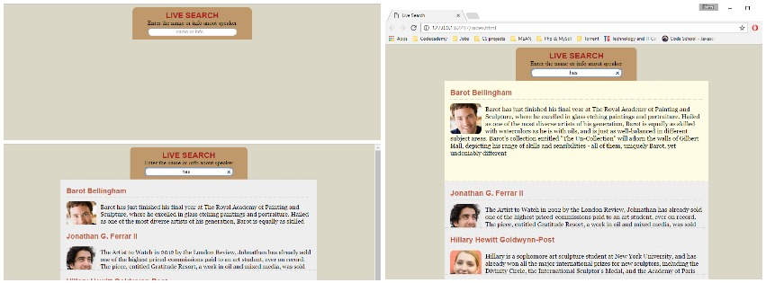

This is a repository for my project:

# Live-Search-Application-using-JavaScript-jQuery-and-Ajax

The ability to read data and communicate information asynchronously is fundamental to modern web applications.In this, I have done this project by integrating AJAX (Asynchronous JavaScript and XML) with JavaScript and jQuery—a combination that makes it easy to work with dynamic data and reduces the number of requests to the server.

Take a look at the finished project [here](https://dileepkumar9030.github.io/Live-Search-Application-using-JavaScript-jQuery-and-Ajax/) hosted using [Github Pages](https://pages.github.com/).

## Description

This is a real project in Ajax that I have a built a live search application,which lets u type in some text in the search input field and shows u only the record in the JSON document that match the search along with some CSS transitions.Its a dynamic search application that updates search results as you type in it.The technologies used in it are HTML,CSS transitions,JavaScript,jQuery,Ajax,JSON,XML

## More Stuff
For more projects and coding stuff, follow me @[Dileep Kumar](https://github.com/dileepkumar9030)
